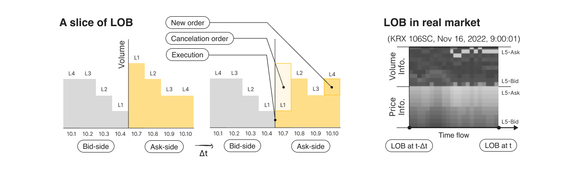
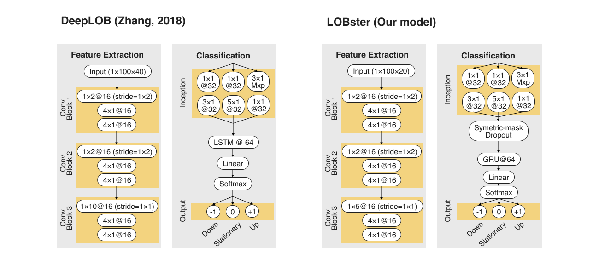

# LOBster 

LOBster is a project entitled <Limit order book (LOB) driven simultaneous time-series estimation in real-market-microstructure>, which is end-to-end machine learning pipeline to predict future mid-price using limit order book. Our project provides a source code of the machine learning pipeline that contains data processing, model training and inference. It contains an implementation of DeepLOB (Zhang, 2018) and our modified model.  
We also provide an implementation of handling code for FI-2010 (Ntakaris et al., 2017), a publicly available benchmark dataset for mid-price forecasting for limit order book data. In addition, we provide a pre-processing tools for custom raw LOB dataset collected in real market microstructure. The pre-processing tool contains several useful functions, such as down-sampling, normalization and labeling.  
Lastly, our project provides some modules that test the classification performance of trained model. Specially, it contains a simple market simulator that test whether inference of model works in real market microstructure. It tests the trading performance (i.e. cumulative profits) based of inference on the test set.


## Problem and challenge

### Importance of estimate the order flow
- Estimate the order flow and predict the future mid-price is important and useful for various market participants.
- For regulation authorities: For regulation authorities, they can predict the market toxic orders and price collapses. Also, based on the prediction, they can preemptively intervene the market for financial market stability. There is a well known example like market flash crash (2010), which shows toxic orders and its positive feedback causes market collapse.
- For liquidity providers (market makers): Market makers takes bid-ask spread as their profit. However, they take risks from malicious inventories caused by one-sided orders from 'information-based traders'. This kind of risk is often calls 'inventory risk', which is a major challenge for market makers. Estimate the order flow gives a change that can minimize the inventory risk for market makers.
- For other market participants: Hedge investors can further defend profit by minimize their risk based on predictions of future mid-price. Also, speculate traders can pursue profits based on predicted information.

### Difficulty
- Efficient market hypothesis: It is a hypothesis about financial market tha asset prices reflect all available information in the market (Ball and Brown 1968; Fama et al., 1969). According to this hypothesis, we can not extract any meaningful information from the price data to predict its future.
- Validation challenges of the financial models: Financial market and its data has extremely high complexity. Due to its high complexity, it is easy to be overfitted in long-term financial data (S. Jen, 2021).
- Based on these difficulties, our approach is to use limit order book data. Since it is a collection of order information, it contains more information than price data. Also, it has extremely short timeframe with millisecond unit. So, it has low risk to be overfitted.

### Limit order book (LOB)

- LOB is a centralised and transparent system that matches customer orders on an ‘price time priority’ basis.
- LOB data is a stack of order and execution which might have information from market participants (Easley, et al., 2012)


## Dataset

### FI-2010
- FI-2010 (Ntakaris et al., 2017) is a publicly available benchmark dataset for mid-price forecasting for limit order book data
([FI-2010](https://etsin.fairdata.fi/dataset/73eb48d7-4dbc-4a10-a52a-da745b47a649)).
- It is collected for 5 stocks in NASDAQ Nordic stock market for a time period of ten consecutive days.
- It has 10 levels of LOB data that has been normalized with three different methods: Z-scoring, min-max and decimal-precision normalization.
- It also provides annotated label for 5 different time horizons: 10, 20, 30, 50, and 100 ticks.
### KRX
- FI-2010 is a useful benchmark LOB dataset, but it can not guarantee that the model works on current market which is much high-frequent.
- To ensure model works on current market microstructure, we collected LOB of two futures (KS200, KQ150) for 13 days (Nov 16 ~ Dec 2, 2022) without down-sampling.
- KRX future market has 5 levels limit order book system.
- Using ```loaders.krx_preprocess.__normalize_data__```, you can normalize the raw collected data with three different methods: Z-scoring, min-max and decimal-precision normalization.
- Using ```loaders.krx_loader.__split_x_y__```, you can generate the label with any arbitrary predict horizon. More detailed labeling method is shown in following equation.
  $$m_{-}(t)=\frac{1}{k} \sum_{i=0}^k p_{t-i}$$
  $$m_{+}(t)=\frac{1}{k} \sum_{i=0}^k p_{t+i}$$
  $$l_t=\frac{m_{+}(t)-m_{-}(t)}{m_{-}(t)}$$  
  If the $l_t > +\alpha$, the label is $+1$ (Up). Else, if the $l_t < -\alpha$, the label is $-1$ (Down). Otherwise, the label is $0$ (Stationary). The $\alpha$ indicates threshold.

## Models


### DeepLOB (Zhang, 2018)
- DeepLOB is a convolutional neural network based model for limit order book data.
- It consists of three convolution block, inception layer and LSTM.

### LOBster (Our model)
- LOBster is a lighten version of DeepLOB tuned for 5 level orderbook system (i.e. Korea exchange future market). Convolution layer for feature extraction were modified for 5 level orderbook input data.
- Since the number of input feature is reduced to half, the risk of overfitting the model has increased. Thus, we adopted a symmetric-mask dropout after the inception layer. Symmetric-mask dropout means that mask is replicated in time-axis, to keep the timeseries dependent extracted feature.
- LSTM was replaced to Gated recurrent unit (Chung et al., 2014)

### Hierarchical feature integration

- DeepLOB and our modified model has three convolutional block. This architecture is a specialized form of convolutional neural network to utilize the characteristic of limit order book data.
- The first convolutional block integrates the price and volume data in each ask-side and bid-side.
- The second convolutional block integrates the ask-side and bid-side in a level.
- The third convolutional block integrates the multi levels of LOB.
- These hierarchical feature integration helps the network to extract the meaningful feature as the combination of price and volume data, such as micro-price.

## Guideline

### Setup
1. Download the FI-2010 dataset ([FI-2010](https://etsin.fairdata.fi/dataset/73eb48d7-4dbc-4a10-a52a-da745b47a649)) and unzip it on the project folder.
2. Install the NVIDIA toolkit for GPU support
   ([CUDA 11.0](https://developer.nvidia.com/cuda-toolkit-archive),
   [CUDNN 8](https://developer.nvidia.com/rdp/cudnn-download))
3. Check the CUDA is available
    ```angular2html
    nvidia-smi
    ```
4. Install the dependency libraries
    ```angular2html
    pip install requirements.txt
    ```

### Running experiments
1. Hyperparameter setting  
   Open the ```optimizers/hyperparams.yaml``` to modify the hyperparameter setting. You can set the batch size, learning rate, epsilon, maximum epoch and number of workers to load dataset. Otherwise, the experiments will conduct under our fine-tuned hyperparameters.
   ```angular2html
   [model name]:
     batch_size: 128
     learning_rate: 0.0001
     epsilon: 1e-08
     epoch: 30
     num_workers: 4
   ```
2. Experiment setting  
   Open the ```main.py``` to set the experiment parameters. Our base experiment setting already implements in the ```main.py```, so you don't have to modify it.
   ```angular2html
    # experiment parameter setting
    dataset_type = 'fi2010'
    normalization = 'Zscore'
    model_type = 'lobster'
    lighten = True
    
    T = 100
    k = 4
    stock = [0, 1, 2, 3, 4]
    train_test_ratio = 0.7
   ```
   - ```dataset_type```: Dataset for experiment. You can select 'fi2010' or 'krx'. (only 'fi2010' is available in public demo version)
   - ```normalization```: Normalization method. 'Zscore', 'MinMax', and 'DecPre' are available.
   - ```lighten```: It determines whether the experiment uses the 10-level LOB data or 5-level reduced LOB data. If lighten is True, experiment will only use the 5-level reduced data. This parameter affects not only the input dataset, but also the architecture of the model.
   - ```model_type```: Model used in experiment. 'deeplob' and 'lobster' is available.
   - ```T```: Length of time window used in single input. T = 100 used in paper and our experiment.
   - ```k```: Prediction horizion. For fi-2010, 0, 1, 2, 3, 4 is available, which indicates the 10, 20, 30, 50, 100 ticks of horizon. For krx, any prediction horizon is available.
   - ```stock```: Stock dataset used in experiment. For FI-2010, [0, 1, 2, 3, 4] are available, which indicates corresponding individual stocks. For KRX, ['KS200', 'KQ150'] are available. You can use multi-stocks for single experiments.
   - ```train_test_ratio```: Ratio to split the training set and test set. For example, if the train_test_ratio is 0.7, the early 0.7 days data are used for training set and the late 0.3 days data are used for test set.
3. Run the main.py
    ```angular2html
    python main.py
    ```
4. Check the experiment result  
   When you run the ```main.py```, it will automatically generate a unique ID for each experiment and print it. It includes some information for experiment, such as model type and experiment datetime (ex. lobster-lighten_2022-12-03_10:34:05). The trained model and all the corresponding result will save in ```loggers/results/[model id]```.
5. Evaluate the model  
   The implemented code will automatically give the visualization of training process, classification reports (confusion matrix, accuracy, precision, recall, f1-score) and market simulation result. Note that market simulation is not available on FI-2010 dataset, since it only provides the normalized price data. Or, if you want to re-generate the above evaluation, you can run the code with the corresponding model id.

## References
Our reference papers are listed in [References.md](./References.md).

